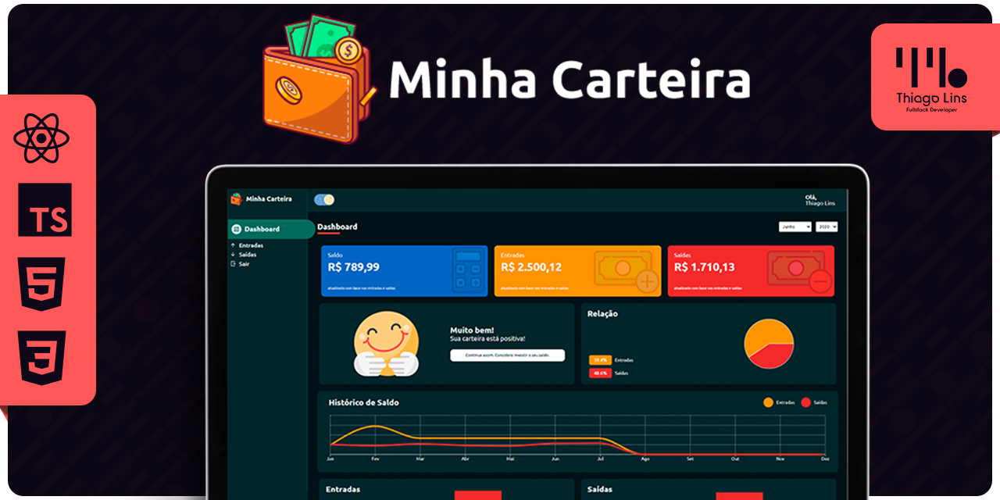

# Minha Carteira
<div align="center" id="top">


 <a href="https://td-watchme.vercel.app/"></a>

&#xa0;

[Demo](https://minha-carteira-five.vercel.app/)
<p align="center"><a href="https://github.com/thiilins/minha-carteira">
  
</a>

<a href="https://github.com/thiilins/minha-carteira">
  
</a>

<a href="https://github.com/thiilins/minha-carteira">
  
</a>

<a href="https://github.com/thiilins/minha-carteira/blob/main/LICENSE">
  
</a></p>


</div>


## 📖 Índice

- [Descrição](#-descrição)
- [Funcionalidades Principais](#-funcionalidades-principais)
- [Capturas de Tela](#-capturas-de-tela)
- [Instalação](#-instalação)
- [Tecnologias Utilizadas](#-tecnologias-utilizadas)
- [Licença](#-licença)
- [Agradecimentos](#-agradecimentos)
- [Possibilidades de Melhorias Futuras](#-possibilidades-de-melhorias-futuras)

## 📜 Descrição

Minha Carteira é uma aplicação web de gerenciamento de finanças pessoais, desenvolvida com o objetivo de ajudar os usuários a controlarem suas despesas, acompanhar seu fluxo de caixa e alcançar metas financeiras. Com uma interface intuitiva e recursos avançados, a aplicação permite um melhor entendimento dos hábitos financeiros e auxilia na tomada de decisões financeiras conscientes.

## 🚀 Funcionalidades Principais

#### Registro de Transações
Registre suas despesas e receitas com facilidade, especificando a categoria, data, descrição e valor. Essa funcionalidade permite que você tenha um controle completo das suas transações financeiras, facilitando o acompanhamento das movimentações.

#### Controle de Despesas
Acompanhe suas despesas por categorias e visualize gráficos para uma análise mais detalhada. Essa funcionalidade oferece uma visão clara de como você está gastando seu dinheiro, permitindo identificar áreas de maior ou menor impacto no seu orçamento.

#### Fluxo de Caixa
Obtenha uma visão geral do seu fluxo de caixa, incluindo receitas, despesas e saldo atual. Essa funcionalidade fornece uma perspectiva consolidada das suas finanças, permitindo que você entenda melhor a saúde financeira e tome decisões informadas.

#### Metas Financeiras
Defina metas financeiras personalizadas e acompanhe seu progresso ao longo do tempo. Com essa funcionalidade, você pode estabelecer objetivos financeiros claros, como economizar para uma viagem ou quitar dívidas, e visualizar seu avanço de forma visual e motivadora.

#### Gerenciamento de Contas
Adicione suas contas bancárias e cartões de crédito para um controle completo das suas finanças. Essa funcionalidade permite que você integre suas contas existentes na plataforma, facilitando o acompanhamento de saldos e movimentações.

#### Orçamento Mensal
Estabeleça um orçamento mensal e receba notificações quando estiver próximo de atingir o limite. Com essa funcionalidade, você pode definir um limite de gastos mensais e receber alertas quando estiver se aproximando desse limite, ajudando a manter o controle das suas despesas.

#### Relatórios Detalhados
Acesse relatórios detalhados com gráficos e métricas para uma análise abrangente das suas finanças. Essa funcionalidade fornece insights valiosos sobre seus padrões de gastos e comportamento financeiro, permitindo uma análise mais aprofundada e identificação de áreas de melhoria.

## 📷 Capturas de Tela

**Em Construção 🔨🚧**
 
## ⚙️ Instalação

Clone este repositório:

```bash
git clone https://github.com/thiilins/minha-carteira.git
```

Acesse o diretório do projeto:

```bash
cd minha-carteira
```
Instale as dependências:
```bash
yarn
```
Inicie a aplicação:
```bash
yarn dev
```
Acesse a aplicação em seu navegador em: `http://localhost:3000` 

### 💻 Tecnologias Utilizadas
- ReactJS
- Node.js
- Express
- MongoDB
- CSS3
- HTML5

## 📄 Licença
Este projeto está licenciado sob a Licença MIT. Consulte o arquivo LICENSE para obter mais informações.

## 🙏 Agradecimentos
Agradecemos a todos os contribuidores que tornaram este projeto possível.

## 💡 Possibilidades de Melhorias Futuras

Aqui estão algumas sugestões de melhorias que podem ser implementadas no futuro para aprimorar ainda mais a aplicação Minha Carteira:

- **Integração Bancária:** Implementar integração com instituições financeiras para importar automaticamente transações bancárias e simplificar o registro manual.
- **Notificações Personalizadas:** Adicionar recursos de notificação para alertar o usuário sobre pagamentos em atraso, alterações nas contas bancárias, metas financeiras atingidas, entre outros.
- **Sincronização em Nuvem:** Permitir que os dados da aplicação sejam sincronizados em nuvem para que os usuários possam acessá-los em diferentes dispositivos.
- **Planejamento de Orçamento:** Incluir recursos avançados de planejamento de orçamento, como a criação de categorias personalizadas, definição de metas de gastos, análise de variações orçamentárias, entre outros.
- **Exportação de Dados:** Adicionar funcionalidade de exportação de dados para formatos comuns, como CSV ou PDF, permitindo que os usuários façam backup ou compartilhem suas informações financeiras.
- **Inteligência Artificial:** Utilizar técnicas de inteligência artificial para fornecer insights personalizados, análise preditiva de gastos, recomendações de investimentos, entre outros recursos avançados.

Essas são apenas algumas ideias de melhorias que podem ser implementadas no futuro. Fique à vontade para contribuir com novas sugestões e ideias para tornar a aplicação Minha Carteira ainda mais incrível!

