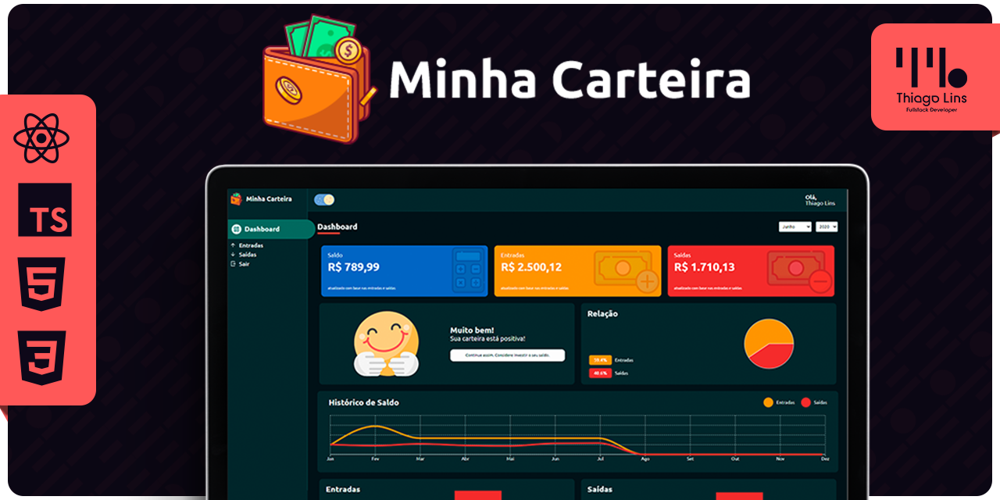

🇧🇷 [Português](./README.md) | 🇺🇸 [English](./README_EN.md) | 🇪🇸 [Español](./README_ES.md)

# Minha carteira

<div align="center">



[Demo en Vivo](https://minha-carteira-five.vercel.app/)


</div>

## 📖 Índice

- [Sobre el Proyecto](#-sobre-el-proyecto)
- [Funcionalidades](#-funcionalidades)
- [Capturas de pantalla](#-capturas-de-pantalla)
- [Instalación y Uso](#-instalación-y-uso)
- [Tecnologías](#-tecnologías)
- [Licencia](#-licencia)
- [Cómo Contribuir](#-cómo-contribuir)
- [Agradecimientos](#-agradecimientos)
- [Mejoras Futuras](#-mejoras-futuras)
- [Contacto](#-contacto)

## 📘 Sobre el Proyecto

**Minha carteira** es una aplicación web dirigida a la gestión de finanzas personales. Está diseñada para ayudar a los usuarios a controlar sus gastos, seguir su flujo de caja y alcanzar metas financieras.

## 🚀 Funcionalidades

#### Registro de Transacciones

Registra tus gastos e ingresos con facilidad, especificando la categoría, fecha, descripción y valor. Esta funcionalidad te permite tener un control total de tus transacciones financieras, facilitando el seguimiento de los movimientos.

#### Control de Gastos

Monitorea tus gastos por categorías y visualiza gráficos para un análisis más detallado. Esta funcionalidad ofrece una visión clara de cómo estás gastando tu dinero, permitiéndote identificar áreas de mayor o menor impacto en tu presupuesto.

#### Flujo de Caja

Obtén una visión general de tu flujo de caja, incluyendo ingresos, gastos y saldo actual. Esta funcionalidad proporciona una perspectiva consolidada de tus finanzas, permitiéndote comprender mejor la salud financiera y tomar decisiones informadas.

#### Metas Financieras

Establece metas financieras personalizadas y sigue tu progreso a lo largo del tiempo. Con esta funcionalidad, puedes establecer objetivos financieros claros, como ahorrar para un viaje o pagar deudas, y ver tu progreso de manera visual y motivadora.

#### Gestión de Cuentas

Añade tus cuentas bancarias y tarjetas de crédito para un control completo de tus finanzas. Esta funcionalidad te permite integrar tus cuentas existentes en la plataforma, facilitando el seguimiento de saldos y movimientos.

#### Presupuesto Mensual

Establece un presupuesto mensual y recibe notificaciones cuando estés cerca de alcanzar el límite. Con esta funcionalidad, puedes definir un límite de gasto mensual y recibir alertas cuando te acerques a ese límite, ayudando a mantener el control de tus gastos.

#### Informes Detallados

Accede a informes detallados con gráficos y métricas para un análisis exhaustivo de tus finanzas. Esta funcionalidad ofrece valiosos insights sobre tus patrones de gasto y comportamiento financiero, permitiendo un análisis más profundo e identificación de áreas de mejora.

## 📸 Capturas de pantalla

#### En Construcción 🔨🚧

## ⚙️ Instalación y Uso

```bash

#Clona este repositorio:
git clone https://github.com/thiilins/minha-carteira.git


#Accede al directorio del proyecto:
cd minha-carteira

#Instala las dependencias:
yarn
#ou
npm install

#Inicia la aplicación:
yarn dev

#Accede a la aplicación en tu navegador en: `http://localhost:3000`
```

## 🛠 Tecnologías

- ReactJS
- Node.js
- Express
- SQLite
- CSS3
- HTML5

## 📜 Licencia

Este proyecto está bajo la licencia MIT. Consulta el archivo [LICENSE](./LICENSE) para más detalles.

## 🤝 Cómo Contribuir

1. **Fork** este repositorio.
2. Crea una nueva **branch** con tus modificaciones: `git checkout -b mi-funcionalidad`.
3. Guarda tus cambios y crea un mensaje de commit explicando lo que hiciste: `git commit -m "funcionalidad: Mi nueva funcionalidad"`.
4. Envía tus cambios: `git push origin mi-funcionalidad`.
5. Presenta tu **pull request**.

## 🙌 Agradecimientos

Agradecemos a todos los colaboradores que hicieron posible este proyecto.

## 💡 Mejoras Futuras

Aquí hay algunas sugerencias de mejoras que se pueden implementar en el futuro para mejorar aún más la aplicación Minha carteira:

- **Integración Bancaria:** Implementar integración con instituciones financieras para importar automáticamente transacciones bancarias y simplificar el registro manual.
- **Notificaciones Personalizadas:** Añadir funciones de notificación para alertar al usuario sobre pagos atrasados, cambios en cuentas bancarias, metas financieras alcanzadas, entre otros.
- **Sincronización en la Nube:** Permitir que los datos de la aplicación se sincronicen en la nube para que los usuarios puedan acceder desde diferentes dispositivos.
- **Planificación de Presupuesto:** Incluir funciones avanzadas de planificación de presupuesto, como la creación de categorías personalizadas, definición de metas de gasto, análisis de variaciones presupuestarias, entre otros.
- **Exportación de Datos:** Añadir la funcionalidad de exportar datos a formatos comunes, como CSV o PDF, permitiendo que los usuarios respalden o compartan su información financiera.
- **Inteligencia Artificial:** Utilizar técnicas de inteligencia artificial para proporcionar insights personalizados, análisis predictivo de gastos, recomendaciones de inversión y otras funcionalidades avanzadas.

Estas son solo algunas ideas para mejoras futuras. ¡Siéntete libre de contribuir con nuevas sugerencias e ideas para hacer la aplicación Minha carteira aún más increíble!

## 📬 Contacto

Para sugerencias, comentarios o preguntas, por favor abre un [issue](https://github.com/thiilins/minha-carteira/issues) o contáctame a través de mi [perfil de GitHub](https://github.com/thiilins).
